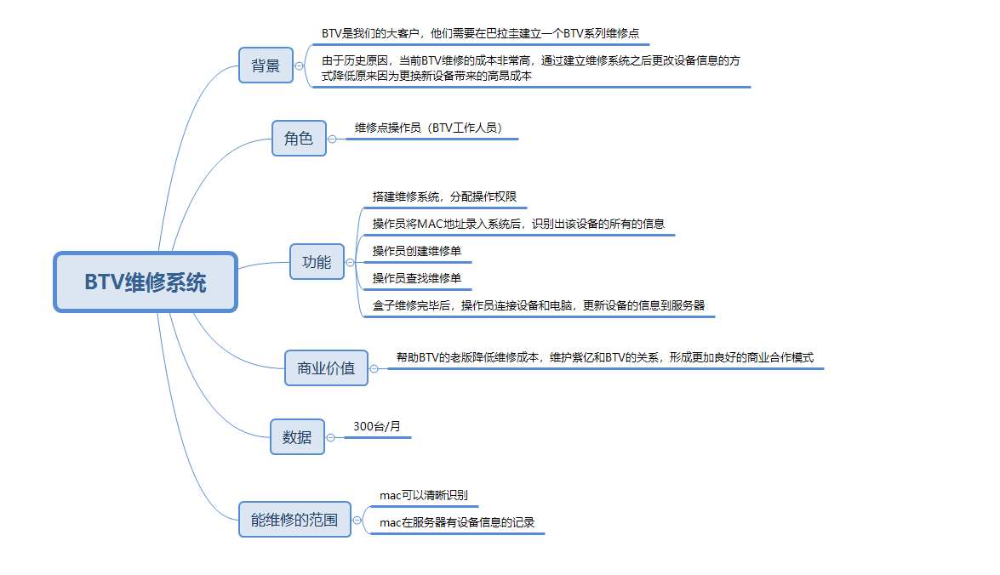

## 需求约束和要点：

1. 本系统部署要求独立云账号部署（因为直接使用人是外司人员，避免账号间干扰）；服务器、DB等服务端资源，均应统一在该账号下部署，我司运维统一维护管理；
2. 由于本系统涉及BTV后台服务的DAC、User等服务交互，因此需要为该服务器（群）设立安全组和访问权限；非本系统的外部访问予以拒绝；
3. 由于本系统的服务对象是合作伙伴，使用频率也相对较低，因此服务建设所使用的服务器、DB配置都不需过高，以控制成本；
4. 系统服务采用SSL 客户端证书访问服务器（以确保用户仅在此终端使用该系统）；证书在系统部署时独立发放；是否还需要账号密码体系、是否需要多用户支持，需产品和用户确认；
5. 本系统使用终端、返修盒子与服务器间必须有良好的网络通道才能使用；
6. 设备维修前后，应保持MAC地址不变（即使重刷固件、更换芯片或更换网卡）；以主板上的MAC贴纸为准，维修前后均应保持该MAC地址（如果Flash变更，也应使用厂测程序将MAC地址置为该地址）；
7. 需要开发专用的厂测程序，增加：访问外网ST服务、加强Reqest/Reqponse安全级别、英语化等功能；
8. ST服务需增加先行判定逻辑，只有在维修单系统登记维修的MAC，才能进行ST下发；

## 主逻辑流程

1. 维修工接收到返修设备，使用本系统对设备MAC进行登记（扫码或手工输入），创建维修单；
2. 系统后台对上述MAC进行判定：该MAC在对应的DAC数据库（//具体表名）出厂MAC里，有且仅有1个，则可以正常进入返修流程；否则认为设备非法，不能进入维修流程；
3. 维修工对设备进行诊断、维修，判定修复后将设备接入网络；
4. 在维修单系统点击“已修复”功能，重新执行ST刷机功能；（后台允许该MAC重刷ST）；
5. 维修工在设备上启动厂测程序，触发ST刷机功能，等待完成刷机；
6. 系统后台将原有设备信息报废，增加新设备信息与MAC的绑定关系；
7. 后台记录维修单完成历史，并提供接口查询月度的刷机数量；

