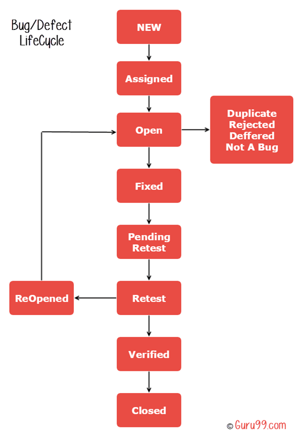

# Bugs?
## Why Jira?
- World No.1 and most widely used
- Agile/Scrum，Requirement，Task，defects，Service Desk，Documents......
- FreshDesk/GitLab Issue/Lanhu? -> self-made
## Life Cycle

- 严重故障（标准：客服报障超过10例；其它来源，阻碍主用例的故障）
	立即上升，发动一切相关资源
- 重复报障
	Link/Duplicate，告知
- 误报
	告知相关人，避免继续误报
- 不是我的问题呀
	明显分配错误的，抓紧时间重新分配；多端扯皮的，请拿证据说话
- 第三方依赖问题
	证据；可能的推动第三方改进
- 我现在没时间处理
	确定你的可用时间；向上级反映问题，调度资源
- 无法重现
	看谁狠
- 缺乏足够手段进行分析
	全链路染色；日常工作注意证据链补充和工具定制
## Rules
- 工作日，24小时内接障（In Progress）
- 工作日，72小时解决
- 排期或版本的，注明排期或者版本号
- 所有动作在Jira留痕，比如：“测试通过”，“由于用户XXXX的不当使用方法，导致XXXX问题”
- 关键证据附注在Jira